# Arquitectura — ePayco Subscriptions for WooCommerce

**Versión**: 6.5.3 | **Gateway ID**: `woo-epaycosubscription` | **Namespace**: `EpaycoSubscription\Woocommerce`

---

## 1. Visión General del Sistema

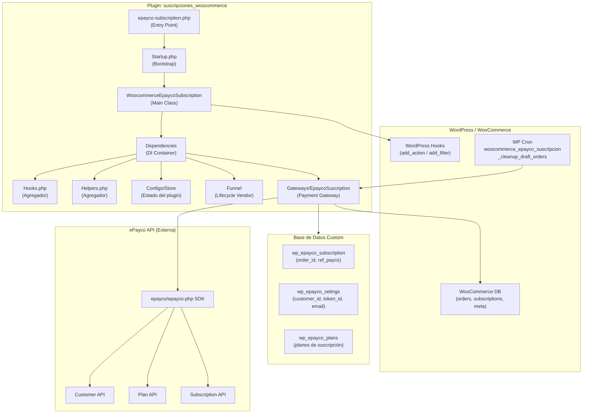

---

## 2. Estructura de Clases (Jerarquía)

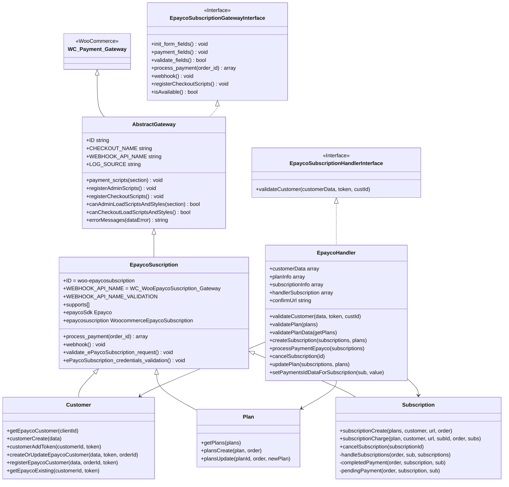

---

## 3. Contenedor de Inyección de Dependencias

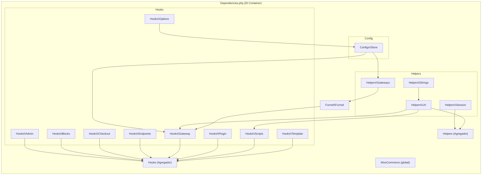

---

## 4. Sistema de Hooks de WordPress

```mermaid
graph TD
    subgraph WP_LIFECYCLE["Ciclo de vida WordPress"]
        PL["plugins_loaded"]
        INIT["woocommerce_init"]
        ADMIN_ENQUEUE["admin_enqueue_scripts"]
        WP_ENQUEUE["wp_enqueue_scripts"]
        BLOCK_ENQUEUE["enqueue_block_assets"]
        BEFORE_WC_INIT["before_woocommerce_init"]
    end

    subgraph WC_HOOKS["Hooks WooCommerce"]
        WC_GW["woocommerce_payment_gateways"]
        WC_GW_TITLE["woocommerce_gateway_title"]
        WC_AVAIL["woocommerce_available_payment_gateways"]
        WC_FIELDS["woocommerce_checkout_fields"]
        WC_UPDATE_META["woocommerce_checkout_update_order_meta"]
        WC_RECEIPT["woocommerce_receipt_*"]
        WC_THANKYOU["woocommerce_thankyou_*"]
        WC_UPD_OPTIONS["woocommerce_update_options_payment_gateways_*"]
        WC_BLOCKS_REG["woocommerce_blocks_payment_method_type_registration"]
        WC_API["woocommerce_api_WC_WooEpaycoSuscription_*"]
    end

    subgraph PLUGIN_ACTIONS["Custom Plugin Actions"]
        EP_CREDS["epaycosubscription_plugin_credentials_updated"]
        EP_STORE["epaycosubscription_plugin_store_info_updated"]
        EP_MODE["epaycosubscription_plugin_test_mode_updated"]
        EP_LOADED["epaycosubscription_main_plugin_loaded"]
    end

    PL --> |"init()"| WC_GW & WC_BLOCKS_REG
    BEFORE_WC_INIT --> |"declara compatibilidad"| WC_GW
    INIT --> WC_FIELDS
    WC_FIELDS --> |"Hooks\\Gateway"| CAMPOS["epayco_billing_type_document<br/>epayco_billing_dni"]
    WC_UPDATE_META --> |"epayco-subscription.php"| META["order_meta: type_document, dni"]
    WC_AVAIL --> |"filtra si NO hay suscripciones"| HIDE["Oculta gateway"]
    WC_API --> |"Endpoints"| WEBHOOK["webhook() / validate_request()"]
    ADMIN_ENQUEUE --> |"Scripts"| ADMIN_ASSETS["Admin CSS/JS"]
    WP_ENQUEUE --> |"Scripts"| FRONT_ASSETS["Checkout CSS/JS"]
    WC_UPD_OPTIONS --> |"Gateway"| SAVE_OPT["Guarda config en WP options"]
    EP_CREDS & EP_MODE --> FUNNEL["Funnel.updateStep*()"]
```

---

## 5. Flujo de Pago (Payment Flow)

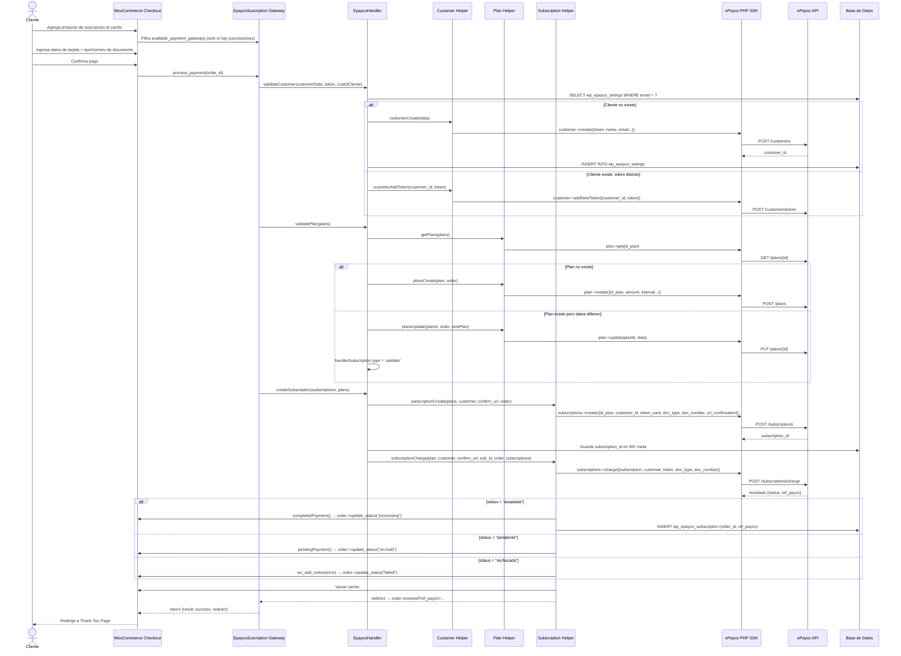

---

## 6. Flujo del Webhook (Confirmación Asíncrona)

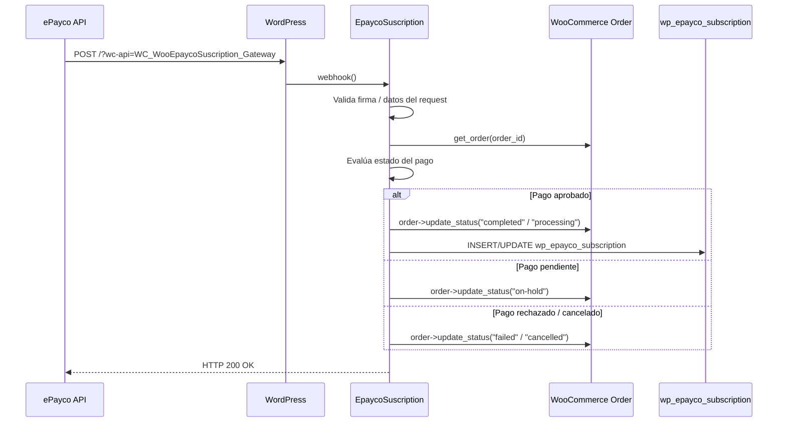

---

## 7. Esquema de Base de Datos

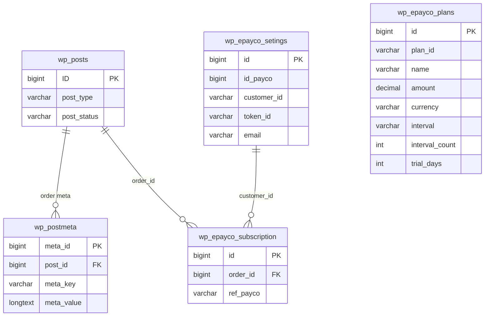

**Meta keys relevantes en `wp_postmeta`**:
| meta_key | Descripción |
|---|---|
| `_epayco_subscription_id` | ID de suscripción en ePayco |
| `epayco_billing_type_document` | Tipo de documento (CC, NIT, etc.) |
| `epayco_billing_dni` | Número de documento |
| `epayco_order_status` | Estado del pago en ePayco |

---

## 8. Integración con ePayco SDK

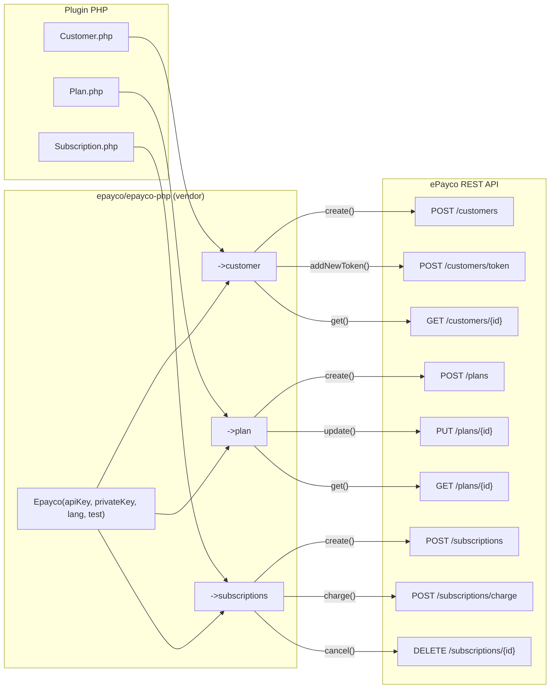

**Inicialización del SDK** (en `EpaycoSuscription.__construct`):
```php
$this->epaycoSdk = new Epayco([
    'apiKey'     => $this->get_option('apiKey'),        // PUBLIC_KEY
    'privateKey' => $this->get_option('privateKey'),    // PRIVATE_KEY
    'lang'       => 'ES',
    'test'       => $this->get_option('environment') === 'yes'
]);
```

---

## 9. Estados de Orden Personalizados

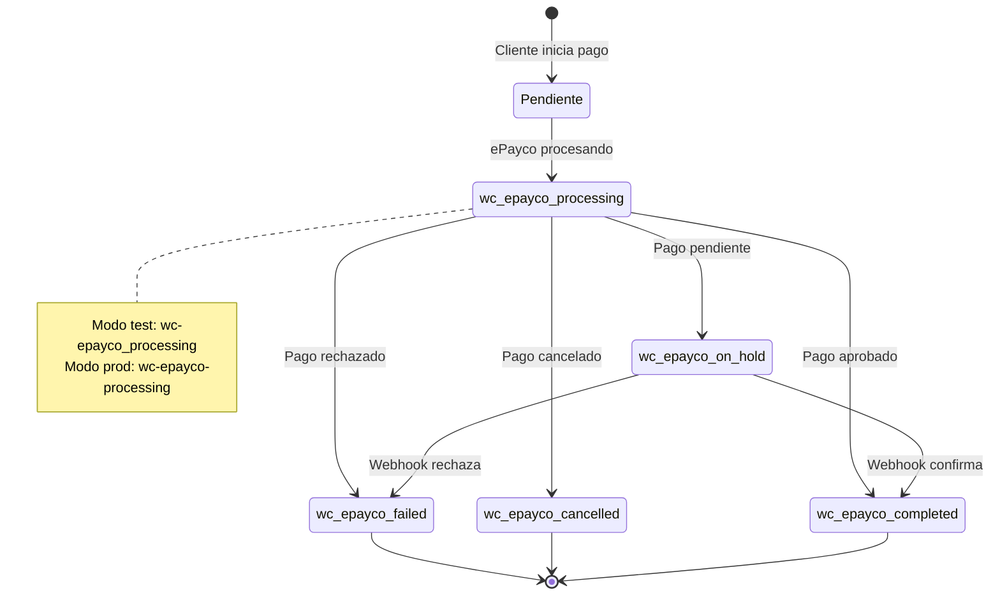

---

## 10. Campos de Checkout Adicionales

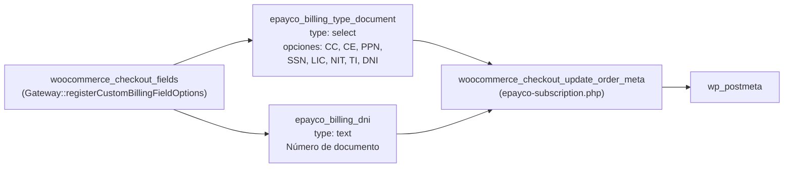

---

## 11. Sistema de Assets (Scripts y Estilos)

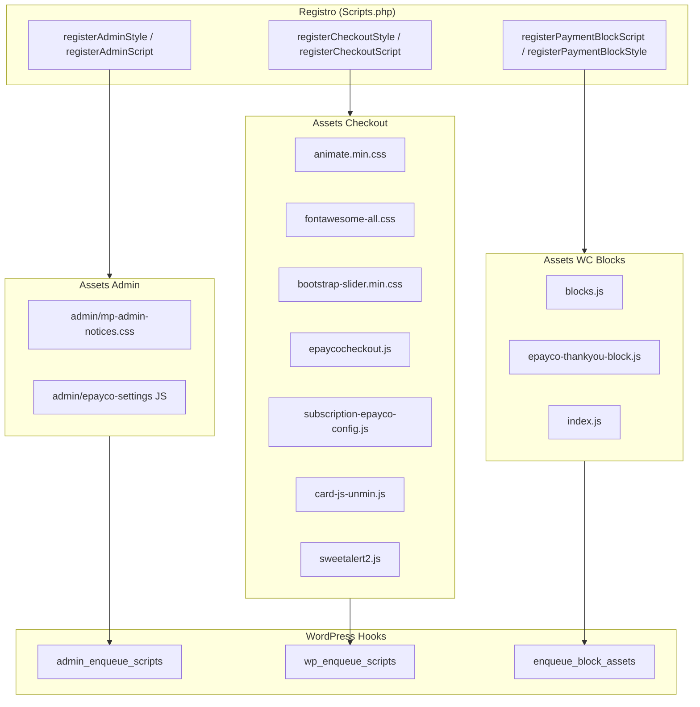

---

## 12. Funnel de Lifecycle del Plugin

```mermaid
stateDiagram-v2
    [*] --> Instalado : register_activation_hook
    Instalado --> FunnelCreado : Funnel::create()
    FunnelCreado --> CredencialesActualizadas : Plugin::UPDATE_CREDENTIALS_ACTION
    CredencialesActualizadas --> ModoActualizado : Plugin::UPDATE_TEST_MODE_ACTION
    ModoActualizado --> Activo : Funnel::updateStepActivate()
    Activo --> Deshabilitado : register_deactivation_hook\nFunnel::updateStepDisable()
    Deshabilitado --> Activo : re-activación
    Activo --> VersionActualizada : upgrader_post_install\nFunnel::updateStepPluginVersion()
    VersionActualizada --> Activo : continúa
    Activo --> Desinstalado : uninstall.php\nFunnel::updateStepUninstall()
    Desinstalado --> [*]
```

---

## 13. Soporte WooCommerce Blocks

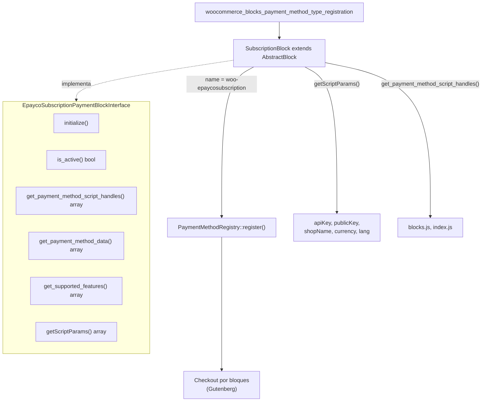

---

## 14. Resumen de Responsabilidades por Capa

| Capa | Clases | Responsabilidad |
|---|---|---|
| **Entry** | `epayco-subscription.php`, `Startup.php` | Bootstrap, DB creation, custom statuses, asset enqueuing |
| **Main** | `WoocommerceEpaycoSubscription` | Orchestration, gateway registration, block support |
| **DI** | `Dependencies` | Wiring de todas las dependencias |
| **Gateway** | `AbstractGateway`, `EpaycoSuscription` | WC Payment Gateway, process_payment, webhook |
| **Business Logic** | `EpaycoHandler`, `Customer`, `Plan`, `Subscription` | ePayco API calls, DB persistence, payment state |
| **Hooks** | `Admin`, `Blocks`, `Checkout`, `Endpoints`, `Gateway`, `Options`, `Plugin`, `Scripts`, `Template` | WordPress hooks registration |
| **Config** | `Store` | Plugin state flags via WP options |
| **Funnel** | `Funnel` | Vendor onboarding lifecycle |
| **Blocks** | `SubscriptionBlock`, `AbstractBlock` | WooCommerce Blocks checkout |
| **Helpers** | `Url`, `Session`, `Form`, `Strings`, `Paths`, `Gateways` | Utilities |
| **Interfaces** | `EpaycoSubscriptionGatewayInterface`, `EpaycoSubscriptionHandlerInterface`, `EpaycoSubscriptionPaymentBlockInterface` | Contracts |
| **Templates** | `subscription.php`, `order-received.php`, notices | Frontend rendering |
